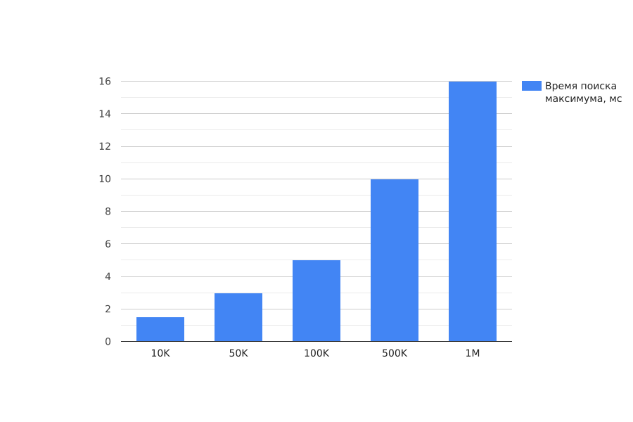

## Техническое задание №2 (ТЗ2)

Создание приложения Java, организация тестирования, запуск минимального CI

## Структура папок

- `src`: папка содержит исходный код приложения
- `lib`: папка содержит фреймворк для тестирования

## Описание классов

Класс App.java реализует приложение по техническому заданию
Класс SimpleClass.java реализует методы, используемые приложением
Класс SimpleClassTest.java реализует методы для тестирования

Дополнительный тест, кроме указанных в техзадании, тестирует метод сложения вызывая в нем исключительную ситуацию, связанную с переполнением целочисленной переменной.

## Измерения времени работы метода поиска максимума в зависимости от размера массива чисел

График зависимости времени обработки массива от его размера

